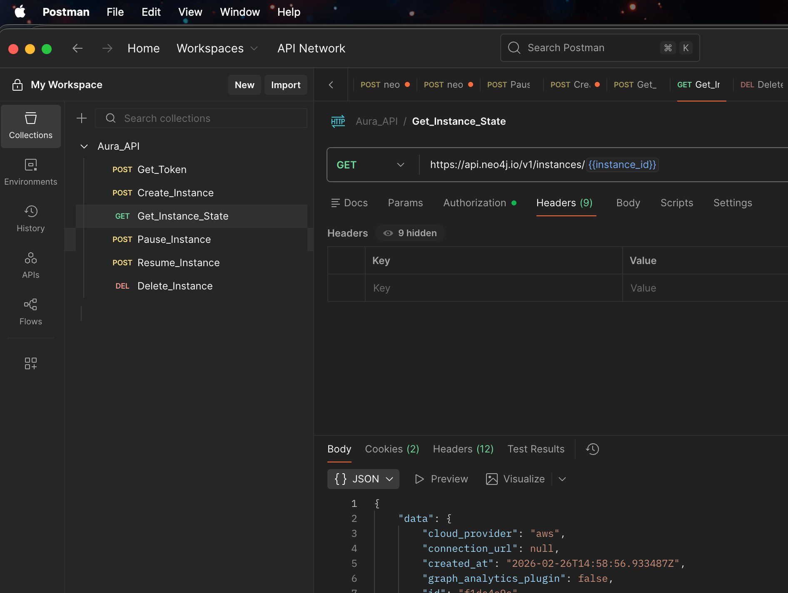
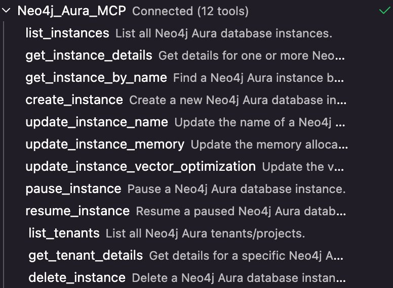
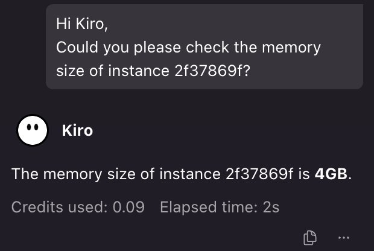

# How to Manage Your Neo4j Aura Instances with the Aura API

## Introduction

The [Neo4j Aura API](https://neo4j.com/docs/aura/platform/api/specification/) gives customers a fully programmatic way to manage their Aura database instances. Using standard REST calls authenticated with OAuth 2.0, you can create instances, check their status, update configuration, pause, resume, and delete them, all without touching the Aura Console. The full API specification is available at [neo4j.com/docs/aura/platform/api/specification/](https://neo4j.com/docs/aura/platform/api/specification/).

This runbook demonstrates these capabilities through a practical migration scenario on AWS: reading a live instance configuration, exporting a snapshot, deleting the instance, and recreating it as a new Aura VDC instance using the API. Each step maps to a real API operation you can reuse independently in your own automation workflows.

All API calls in this runbook have been tested and validated using Postman. A ready-to-use Postman collection is included in this repository under the `postman/` directory. Import it directly to explore or run each operation without writing any shell commands.

---

## Prerequisites

| Requirement | Details |
|---|---|
| Aura API credentials | Client ID and Client Secret from the Aura Console → Account → API Keys |
| `curl` | Available in your shell |
| `jq` | JSON processor (`brew install jq` / `apt install jq`) |
| Neo4j `dump` utility or Aura Console access | For triggering the database dump |
| AWS S3 bucket (optional) | Recommended for storing the dump file |
| Sufficient IAM / Aura permissions | Instance Owner or Admin role on the Aura project |

---

## Step 0: Set Environment Variables

Set these at the start of your session. All subsequent commands reference them.

```bash
export AURA_CLIENT_ID="Your_Aura_API_Client_Id"
export AURA_CLIENT_SECRET="Your_Aura_API_Client_Secret"
export INSTANCE_ID="Your_existing_aura_instance-id"
export WORK_DIR="./aura-migration-$(date +%Y%m%d-%H%M%S)"
mkdir -p "$WORK_DIR"
```

---

## Step 1: Authenticate and Obtain Bearer Token

```bash
TOKEN_RESPONSE=$(curl -sS \
  --request POST "https://api.neo4j.io/oauth/token" \
  --user "${AURA_CLIENT_ID}:${AURA_CLIENT_SECRET}" \
  --header "Content-Type: application/x-www-form-urlencoded" \
  --data-urlencode "grant_type=client_credentials")

export AURA_TOKEN=$(echo "$TOKEN_RESPONSE" | jq -er '.access_token')
echo "Token acquired: ${AURA_TOKEN:0:20}..."
```

> **Note:** Tokens expire after 1 hour. Re-run this step if any subsequent API call returns HTTP 401.

---

## Step 2: Capture Full Existing Instance Configuration

Retrieve all configuration fields and write them to a JSON file. This file is your source of truth for recreating the instance.

```bash
INSTANCE_CONFIG=$(curl --silent --fail \
  --request GET \
  --url "https://api.neo4j.io/v1/instances/${INSTANCE_ID}" \
  --header "Authorization: Bearer ${AURA_TOKEN}" \
  --header "Content-Type: application/json")

echo "$INSTANCE_CONFIG" | jq '.' > "${WORK_DIR}/instance-config.json"

echo "Full configuration saved to ${WORK_DIR}/instance-config.json"
cat "${WORK_DIR}/instance-config.json"
```

Extract and display the key fields you will need to recreate the instance:

```bash
echo "--- Key Configuration Fields ---"
echo "Name:          $(echo "$INSTANCE_CONFIG" | jq -r '.data.name')"
echo "Type/Tier:     $(echo "$INSTANCE_CONFIG" | jq -r '.data.type')"
echo "Region:        $(echo "$INSTANCE_CONFIG" | jq -r '.data.region')"
echo "Cloud:         $(echo "$INSTANCE_CONFIG" | jq -r '.data.cloud_provider')"
echo "Memory (GB):   $(echo "$INSTANCE_CONFIG" | jq -r '.data.memory')"
echo "Storage (GB):  $(echo "$INSTANCE_CONFIG" | jq -r '.data.storage')"
echo "Status:        $(echo "$INSTANCE_CONFIG" | jq -r '.data.status')"
echo "Project ID:    $(echo "$INSTANCE_CONFIG" | jq -r '.data.tenant_id // .data.project_id')"
```

Store the individual values as shell variables for use in Step 6:

```bash
export INST_NAME=$(echo "$INSTANCE_CONFIG"        | jq -r '.data.name')
export INST_TYPE=$(echo "$INSTANCE_CONFIG"        | jq -r '.data.type')
export INST_REGION=$(echo "$INSTANCE_CONFIG"      | jq -r '.data.region')
export INST_CLOUD=$(echo "$INSTANCE_CONFIG"       | jq -r '.data.cloud_provider')
export INST_MEMORY=$(echo "$INSTANCE_CONFIG"      | jq -r '.data.memory')
export INST_STORAGE=$(echo "$INSTANCE_CONFIG"     | jq -r '.data.storage')
export INST_PROJECT_ID=$(echo "$INSTANCE_CONFIG"  | jq -r '.data.tenant_id // .data.project_id')
```

> **Checkpoint:** Open `${WORK_DIR}/instance-config.json` and verify all fields are populated before proceeding.

---

## Step 3: Export an Existing Snapshot from the Aura Console

Aura automatically takes snapshots every hour, so a recent snapshot is already available. There is no need to trigger a new one.

### 3a: Identify and Download the Snapshot

1. Log in to the [Aura Console](https://console.neo4j.io).
2. Navigate to your instance and open the **Snapshots** tab.
3. Identify the most recent snapshot taken before this migration window. Note its timestamp for your audit record.
4. Click the **⋯ (more)** menu next to that snapshot and select **Export**.
5. Aura will prepare the file and prompt a download. The format will be:
   - `.dump` for Neo4j **v4** instances
   - `.backup` for Neo4j **v5** instances

### 3b: Move the Downloaded File into the Working Directory

Set `DUMP_FILE` using the extension that matches your Neo4j version: `.dump` for v4, `.backup` for v5. Update the `mv` source filename to match what was downloaded.

```bash
export DUMP_FILE="${WORK_DIR}/${INSTANCE_ID}.dump"

mv ~/Downloads/<downloaded-filename> "$DUMP_FILE"

echo "Dump saved to: ${DUMP_FILE}"
ls -lh "$DUMP_FILE"
```

### 3c: Copy to S3 for Durability (Recommended)

```bash
aws s3 cp "$DUMP_FILE" \
  "s3://<your-bucket>/neo4j-backups/${INSTANCE_ID}/$(date +%Y%m%d-%H%M%S)-$(basename $DUMP_FILE)"

echo "Dump uploaded to S3."
```

> **Checkpoint:** Confirm the dump file is present in `${WORK_DIR}`, is non-zero in size, and (if using S3) has been successfully uploaded before proceeding to deletion.

---

## Step 4: Record a Pre-Deletion Audit Entry

Write a human-readable summary alongside the raw JSON for audit/rollback purposes.

```bash
cat > "${WORK_DIR}/migration-summary.txt" <<EOF
Neo4j Aura Migration: Pre-Deletion Summary
============================================
Date:              $(date -u +"%Y-%m-%dT%H:%M:%SZ")
Operator:          $(whoami)

Source Instance
---------------
Instance ID:       ${INSTANCE_ID}
Name:              ${INST_NAME}
Type/Tier:         ${INST_TYPE}
Cloud Provider:    ${INST_CLOUD}
AWS Region:        ${INST_REGION}
Memory (GB):       ${INST_MEMORY}
Storage (GB):      ${INST_STORAGE}
Project ID:        ${INST_PROJECT_ID}

Dump File
---------
Local path:        ${DUMP_FILE}
Source:            Hourly automatic snapshot exported from Aura Console

Status
------
Dump verified:     YES (confirm manually)
Config saved:      ${WORK_DIR}/instance-config.json
EOF

cat "${WORK_DIR}/migration-summary.txt"
```

---

## Step 5: Delete the Existing Aura Instance

> ⚠️ **This action is irreversible.** Verify Steps 2–4 are fully complete before running.

```bash
read -p "Are you sure you want to DELETE instance ${INSTANCE_ID} (${INST_NAME})? Type YES to confirm: " CONFIRM

if [[ "$CONFIRM" != "YES" ]]; then
  echo "Deletion aborted."
  exit 1
fi

DELETE_RESPONSE=$(curl -sS \
  -X DELETE "https://api.neo4j.io/v1/instances/${INSTANCE_ID}" \
  -H "Authorization: Bearer ${AURA_TOKEN}" \
  -H "Accept: application/json" \
  -D /tmp/aura_delete_headers.txt \
  -o /tmp/aura_delete_body.txt \
  -w "\nHTTP_STATUS:%{http_code}\n")
echo "$DELETE_RESPONSE"
echo "HEADERS:"
cat /tmp/aura_delete_headers.txt
echo "BODY:"
cat /tmp/aura_delete_body.txt

HTTP_STATUS=$(echo "$DELETE_RESPONSE" | grep "HTTP_STATUS" | cut -d: -f2 | tr -d '[:space:]')

if [[ "$HTTP_STATUS" == "202" ]] || [[ "$HTTP_STATUS" == "200" ]] || [[ "$HTTP_STATUS" == "204" ]]; then
  echo "Instance ${INSTANCE_ID} deletion accepted."
  cp /tmp/aura_delete_body.txt "${WORK_DIR}/delete-response.json"
else
  echo "ERROR: Unexpected HTTP status ${HTTP_STATUS}. Investigate before retrying."
  exit 1
fi
```

### Poll Until Instance is Fully Deleted

```bash
echo "Waiting for instance deletion to complete..."
while true; do
  STATUS_CHECK=$(curl --silent \
    --request GET \
    --url "https://api.neo4j.io/v1/instances/${INSTANCE_ID}" \
    --header "Authorization: Bearer ${AURA_TOKEN}" \
    --write-out "\nHTTP_STATUS:%{http_code}")

  HTTP=$(echo "$STATUS_CHECK" | grep "HTTP_STATUS" | cut -d: -f2)

  if [[ "$HTTP" == "404" ]]; then
    echo "Instance confirmed deleted (404 Not Found)."
    break
  fi

  CURRENT_STATUS=$(echo "$STATUS_CHECK" | grep -v "HTTP_STATUS" | jq -r '.data.status // "unknown"')
  echo "  Status: ${CURRENT_STATUS} still waiting..."
  sleep 20
done
```

---

## Step 6: Recreate the Instance

Use the configuration values captured in Step 2 to create an identical new instance.

> **Note:** Aura VDC (Virtual Dedicated Cloud) instances require an active VDC contract on your project. Confirm this with your Neo4j account team before proceeding.

Re-authenticate first. The token from Step 1 expires after 1 hour and the deletion polling in Step 5 may have consumed most of that window.

```bash
TOKEN_RESPONSE=$(curl -sS \
  --request POST "https://api.neo4j.io/oauth/token" \
  --user "${AURA_CLIENT_ID}:${AURA_CLIENT_SECRET}" \
  --header "Content-Type: application/x-www-form-urlencoded" \
  --data-urlencode "grant_type=client_credentials")
export AURA_TOKEN=$(echo "$TOKEN_RESPONSE" | jq -er '.access_token')

CONFIG_FILE="${WORK_DIR}/instance-config.json"
CREATE_PAYLOAD=$(jq -n \
  --arg name     "$(jq -r '.data.name' $CONFIG_FILE)" \
  --arg type     "$(jq -r '.data.type' $CONFIG_FILE)" \
  --arg region   "$(jq -r '.data.region' $CONFIG_FILE)" \
  --arg cloud    "$(jq -r '.data.cloud_provider' $CONFIG_FILE)" \
  --arg tenant   "$(jq -r '.data.tenant_id' $CONFIG_FILE)" \
  --arg memory   "$(jq -r '.data.memory  | sub("B$"; "")' $CONFIG_FILE)" \
  --arg storage  "$(jq -r '.data.storage | sub("B$"; "")' $CONFIG_FILE)" \
  --argjson graph_plugin "$(jq '.data.graph_analytics_plugin' $CONFIG_FILE)" \
  --argjson vector_opt   "$(jq '.data.vector_optimized' $CONFIG_FILE)" \
  '{
    name:                   $name,
    type:                   $type,
    region:                 $region,
    cloud_provider:         $cloud,
    tenant_id:              $tenant,
    memory:                 $memory,
    storage:                $storage,
    graph_analytics_plugin: $graph_plugin,
    vector_optimized:       $vector_opt
  }')

echo "Create payload:"
echo "$CREATE_PAYLOAD" | jq '.'
```

Submit the creation request:

```bash
CREATE_RESPONSE=$(curl --silent --fail \
  --request POST \
  --url "https://api.neo4j.io/v1/instances" \
  --header "Authorization: Bearer ${AURA_TOKEN}" \
  --header "Content-Type: application/json" \
  --data "$CREATE_PAYLOAD")

echo "$CREATE_RESPONSE" | jq '.'
echo "$CREATE_RESPONSE" > "${WORK_DIR}/create-response.json"

export NEW_INSTANCE_ID=$(echo "$CREATE_RESPONSE" | jq -r '.data.id')
export NEW_INSTANCE_PASSWORD=$(echo "$CREATE_RESPONSE" | jq -r '.data.password // "not-returned"')

echo "New Instance ID: ${NEW_INSTANCE_ID}"
echo "Password:        ${NEW_INSTANCE_PASSWORD}"
```

> ⚠️ **Save the password now.** The Aura API returns the generated password only on creation. Store it in your secrets manager immediately.

Append the new instance details to the audit summary:

```bash
cat >> "${WORK_DIR}/migration-summary.txt" <<EOF

New Instance
------------
New Instance ID:  ${NEW_INSTANCE_ID}
Password saved:   $(date -u +"%Y-%m-%dT%H:%M:%SZ") stored externally
EOF
```

### Poll Until New Instance is Running

```bash
echo "Waiting for new instance to become available..."
while true; do
  NEW_STATUS=$(curl --silent --fail \
    --request GET \
    --url "https://api.neo4j.io/v1/instances/${NEW_INSTANCE_ID}" \
    --header "Authorization: Bearer ${AURA_TOKEN}" | jq -r '.data.status')

  echo "  Status: ${NEW_STATUS}"

  if [[ "$NEW_STATUS" == "running" ]] || [[ "$NEW_STATUS" == "Running" ]]; then
    echo "New instance is running."
    break
  elif [[ "$NEW_STATUS" == "failed" ]] || [[ "$NEW_STATUS" == "Failed" ]]; then
    echo "ERROR: Instance creation failed. Check ${WORK_DIR}/create-response.json."
    exit 1
  fi

  sleep 30
done
```

---

## Step 7: Verify New Instance Configuration

Retrieve the new instance's config and diff it against the original to confirm all fields match.

```bash
NEW_CONFIG=$(curl --silent --fail \
  --request GET \
  --url "https://api.neo4j.io/v1/instances/${NEW_INSTANCE_ID}" \
  --header "Authorization: Bearer ${AURA_TOKEN}")

echo "$NEW_CONFIG" | jq '.' > "${WORK_DIR}/new-instance-config.json"

echo "--- Configuration Comparison ---"
echo ""
printf "%-20s %-30s %-30s\n" "Field" "Original" "New"
printf "%-20s %-30s %-30s\n" "-----" "--------" "---"

for field in type region cloud_provider memory storage; do
  ORIG=$(echo "$INSTANCE_CONFIG" | jq -r ".data.${field}")
  NEW=$(echo "$NEW_CONFIG"       | jq -r ".data.${field}")
  MATCH=$([[ "$ORIG" == "$NEW" ]] && echo "✓" || echo "✗ MISMATCH")
  printf "%-20s %-30s %-30s %s\n" "$field" "$ORIG" "$NEW" "$MATCH"
done
```

---

## Resize an Instance

You can increase (or decrease) storage and memory on a running instance without pausing or taking it offline. The instance remains fully available during the resize operation.

Storage can be changed independently of memory. If you change memory, the included storage allocation adjusts automatically, so check the resulting configuration after a memory resize.

### Increase storage only

```bash
curl -sS \
  -X PATCH "https://api.neo4j.io/v1/instances/${INSTANCE_ID}" \
  -H "Authorization: Bearer ${AURA_TOKEN}" \
  -H "Content-Type: application/json" \
  -H "Accept: application/json" \
  -d '{"storage": "32G"}'
```

### Increase memory only

```bash
curl -sS \
  -X PATCH "https://api.neo4j.io/v1/instances/${INSTANCE_ID}" \
  -H "Authorization: Bearer ${AURA_TOKEN}" \
  -H "Content-Type: application/json" \
  -H "Accept: application/json" \
  -d '{"memory": "16G"}'
```

### Increase both together

```bash
curl -sS \
  -X PATCH "https://api.neo4j.io/v1/instances/${INSTANCE_ID}" \
  -H "Authorization: Bearer ${AURA_TOKEN}" \
  -H "Content-Type: application/json" \
  -H "Accept: application/json" \
  -d '{"memory": "16G", "storage": "32G"}'
```

After the PATCH call, poll `GET /v1/instances/${INSTANCE_ID}` and wait for the status to return `running` before treating the resize as complete.

> **Note:** Downsizing memory is allowed, but only if the new value is equal to or greater than current memory usage. Attempting to downsize below current usage will return an error.

---

## Pause and Resume an Instance

Pausing an instance temporarily stops the database without deleting it. Data is preserved and the instance can be resumed at any time. Aura will automatically resume an instance after 30 days to apply updates.

This makes pause/resume a useful tool for dev, test, or demo instances that do not need to run continuously.

### Pause

```bash
curl -sS \
  -X POST "https://api.neo4j.io/v1/instances/${INSTANCE_ID}/pause" \
  -H "Authorization: Bearer ${AURA_TOKEN}" \
  -H "Accept: application/json"
```

### Resume

```bash
curl -sS \
  -X POST "https://api.neo4j.io/v1/instances/${INSTANCE_ID}/resume" \
  -H "Authorization: Bearer ${AURA_TOKEN}" \
  -H "Accept: application/json"
```

After calling either endpoint, poll `GET /v1/instances/${INSTANCE_ID}` and wait for the status to return `paused` or `running` respectively.

> **Scheduled pause/resume:** You can automate pause and resume on a schedule using a cron job, GitHub Actions workflow, or any scheduler that can run a curl command. For example, pausing every evening at 20:00 UTC and resuming every morning at 07:00 UTC on weekdays keeps your instance available during working hours while minimising cost outside of them. A GitHub Actions example is available at [neo4j.com/blog/developer/automate-start-stop-auradb-instances/](https://neo4j.com/blog/developer/automate-start-stop-auradb-instances/).

---

## Troubleshooting

| Symptom | Likely Cause | Resolution |
|---|---|---|
| HTTP 401 on any API call | Token expired | Re-run Step 1 |
| Snapshot status stuck at `Pending` | Large database or Aura backlog | Wait up to 30 min; contact Neo4j support if persistent |
| HTTP 422 on instance creation | Invalid field value (e.g., unsupported region/version combo) | Cross-check `instance-config.json` against Aura supported tiers |
| HTTP 403 on instance creation | VDC entitlement not active on project | Confirm VDC contract with Neo4j account team |
| Instance creation returns `failed` | Quota exceeded or invalid config | Check Aura Console for quota limits and error messages |
| `jq` parse errors | API response format changed | Print raw response with `| cat` and inspect before piping to `jq` |

---

## Other Ways to Manage Aura Instances

The shell-based approach in this runbook is one of several ways to interact with the Aura API.

**Postman** is a great option for exploring and testing the API interactively. A Postman collection covering all the operations in this runbook is included in the `postman/` directory of this repository. Import it, set your `client_id` and `client_secret` as collection variables, and you can run each request individually without writing any code.



**AI chat agents** are an increasingly practical option for managing Aura instances using plain natural language. Tools like [Kiro](https://kiro.dev) connected to the Neo4j Aura MCP server expose all key API operations as callable tools, with no shell commands or scripts required.

The Neo4j Aura MCP server provides 12 tools out of the box, including `list_instances`, `get_instance_details`, `create_instance`, `pause_instance`, `resume_instance`, `delete_instance`, `list_tenants`, and more:



You can then interact with your instances using natural language. For example, asking Kiro to check the memory of a specific instance returns an instant answer:



Or for more complex operations, simply describe what you need:

> "Hey Kiro, can you please create a business critical instance with name `neo4j-aura-bc-2` in the `us-east1` region on GCP with `tenant_id: abc-....-xyz`, `16G` storage, `8G` memory, and with `vector_optimized` and `graph_analytics_plugin` enabled."

The agent handles the API call, polls for the instance to become available, and returns the connection details. The underlying Aura API is the same regardless of how you call it.

---

## Conclusion

This runbook walked through a full instance migration using the Aura REST API, from capturing configuration and exporting a snapshot through to deletion and recreation as an Aura VDC instance. The same individual API operations (creating an instance, reading its status, deleting it) can be lifted from this runbook and used independently in your own pipelines and automation.

*Runbook version: 1.1 | AWS / Aura VDC*
